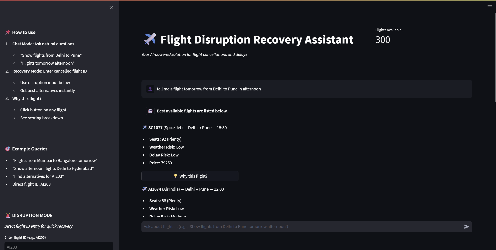
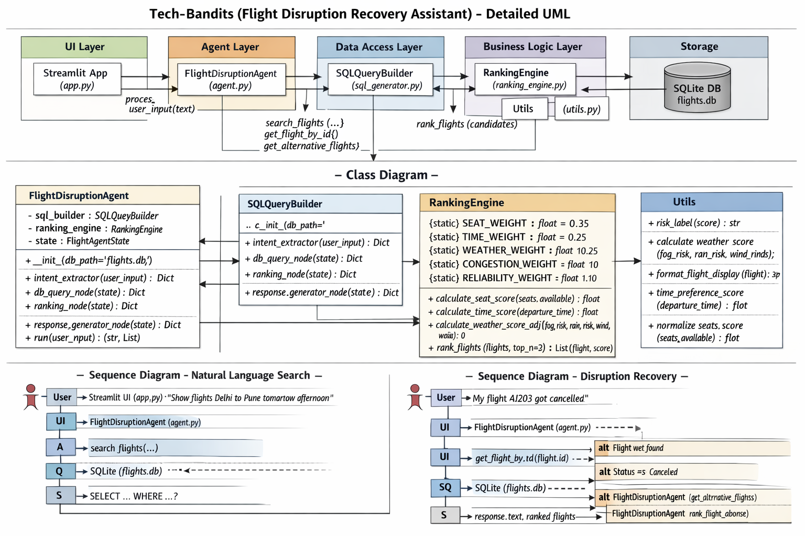

# ✈️ Flight Disruption Recovery Assistant

**An AI-powered Streamlit chatbot for finding alternative flights during cancellations and delays.**

Built for hackathons with a focus on speed, clarity, and intelligent disruption recovery.



---

## 🎯 Features

### Core Capabilities
- **🚨 Disruption Recovery Mode** - Enter a flight ID and instantly get best alternatives
- **🔍 Smart Flight Search** - Natural language queries for flight searches
- **🤖 Intent Detection** - Automatically understands if you're searching or recovering
- **⭐ Intelligent Ranking** - Flights scored on 5 factors: seats, timing, weather, congestion, reliability
- **💡 Explainability** - Click "Why this flight?" to see scoring breakdown
- **⚡ Lightning Fast** - Caching optimization for instant responses

### Product Features
- Clean Streamlit chat interface
- SQLite database with 150+ realistic Indian domestic flights
- Risk labels (Low/Medium/High) instead of raw numbers
- Afternoon time preference optimization (12-17)
- Airport congestion and delay probability scoring
- Weather risk assessment
- Connecting flight fallback (MVP)

---

## 🛠️ Tech Stack

```
Python 3.10+
Streamlit 1.40+
SQLite3
LangGraph (agent workflow)
Pandas
```

---

## 📦 Installation

### 1. Clone Repository
```bash
git clone <repo-url>
cd Tech-Bandits
```

### 2. Create Virtual Environment
```bash
python -m venv venv

# Windows
venv\Scripts\activate

# macOS/Linux
source venv/bin/activate
```

### 3. Install Dependencies
```bash
pip install -r requirements.txt
```

### 4. Initialize Database (Optional)
```bash
python database.py
```
This creates `flights.db` with 150 realistic Indian flights. Run automatically on first app start.

---

## 🚀 Running the App

```bash
streamlit run app.py
```

The app will open in your browser at `http://localhost:8501`

---

## �️ Live Data Architecture

### How It Works

This app features a **hybrid offline/online architecture** using real-time flight data from OpenSky Network API:

- **Online Mode (WiFi ON)**: Click "Sync Live Planes" to fetch current aircraft from OpenSky API
- **Offline Mode (WiFi OFF)**: Browse previously synced flight data from local database
- **Storage**: SQLite database (`flights.db`) - all data is cached locally on your machine

### Sync Workflow

1. **Connect to internet** (WiFi/mobile data)
2. **Launch app**: `streamlit run app.py`
3. **Sidebar → Click "Sync Live Planes (OpenSky)"**
4. **Wait 5-10 seconds** - fetches ~150-200 aircraft over India
5. **Data saved to local database** - no cloud storage needed
6. **Now works offline** - browse and search without internet

### Why It Works Offline

The app uses a **snapshot-based caching model**:

- `flights.db` is a local SQLite file on your computer
- Streamlit runs on `localhost:8501` (your own machine)
- No internet needed to query the local database
- **Think of it like downloading a video vs streaming** - once synced, it's yours

### When to Sync Again

Sync fresh data when:
- Aircraft positions are stale (after several hours)
- Before demos/presentations to show current flights
- After major time zone changes (morning vs evening traffic patterns)
- To capture peak flight hours (7-9 AM, 5-7 PM is best)

### Data Sources

The app supports **dual data sources**:

1. **Live Data (OpenSky Network)** - Real aircraft with actual positions, speed, altitude
2. **Fake Data (Synthetic Database)** - 300 realistic Indian flights for testing

**Default filter**: "Live Only" mode (synced flights take priority)

Toggle in sidebar to switch between fake/live/all data sources.

---

## 📝 How to Use

### Mode 1: Natural Language Search
```
User: "Show flights from Delhi to Pune tomorrow afternoon"
→ Agent extracts: source=Delhi, destination=Pune, date=tomorrow, time=afternoon
→ Returns ranked flights with explanations
```

### Mode 2: Disruption Recovery (Main Demo)
```
User: "My flight AI203 got cancelled"
→ Agent fetches original flight
→ Finds alternatives on same route/date
→ Ranks and displays best 3 options
```

### Mode 3: Direct Flight ID (Fastest)
```
1. Enter "AI203" in sidebar Disruption Mode
2. Click "Find Alternatives"
3. Instantly see best recovery options
```

### Mode 4: Click "Why this flight?"
```
Each flight has explainability button
Shows: "Selected due to low weather risk, available seats, and optimal afternoon timing."
```

### Mode 5: Sync Live Flights (NEW)
```
1. Ensure internet connection
2. Sidebar → "Sync Live Planes (OpenSky)"
3. Wait for sync to complete
4. See real aircraft over India
5. Works offline after sync
```

---

## 🏗️ Architecture

```
app.py
├── Streamlit UI (chat, disruption mode, explainability)
├── Session state management
├── Live data sync controls (OpenSky integration)
└── Caching for performance

agent.py (LangGraph-like workflow)
├── intent_extractor: Classify search vs recovery
├── db_query_node: Execute parameterized SQL
├── ranking_node: Score and rank flights
└── response_generator_node: Format for UI

ranking_engine.py
├── Seat availability scoring
├── Time preference scoring (afternoon preferred)
├── Weather risk scoring
├── Congestion scoring
├── Reliability scoring (delay probability inverse)
└── Explainability generation

sql_generator.py
├── Safe parameterized SQL queries
├── Search flights with optional filters
├── Get alternatives for disrupted flights
├── Handle "Unknown" destinations (OpenSky live data)
└── Prevent SQL injection

database.py
├── SQLite schema initialization
├── Flight data generation (300 realistic flights)
├── OpenSky live data sync (fetch_india_flights)
├── Data source column migration (fake vs live)
├── City and time generation
└── Database seeding

providers/opensky.py (NEW)
├── fetch_india_flights: Real-time aircraft tracking
├── India bounding box: 6.5-35.5°N, 68.0-97.5°E
├── infer_airline_from_callsign: AI→Air India, 6E→IndiGo
├── infer_nearest_city: Distance calculation to 9 major cities
└── No authentication required (public API)

utils.py
├── Risk label mapping (numeric → Low/Medium/High)
├── Weather score calculation
├── Flight display formatting
└── Time preference utilities
```

### System Architecture Diagram



---

## 🎯 Scoring Formula

Each flight is scored on 5 weighted factors:

```python
score = (0.35 * seat_score) +
        (0.25 * time_score) +
        (0.20 * weather_score_adj) +
        (0.10 * congestion_score) +
        (0.10 * reliability_score)

Where:
- seat_score: Normalized available seats (0-1)
- time_score: Preference for afternoon 12-17 (0-1)
- weather_score_adj: Inverse of weather risk (0-1)
- congestion_score: Inverse of airport congestion (0-1)
- reliability_score: Inverse of delay probability (0-1)
```

**Top 3 flights** are returned to user.

---

## 📊 Database Schema

```sql
CREATE TABLE flights (
    flight_id TEXT PRIMARY KEY,
    source TEXT NOT NULL,
    destination TEXT NOT NULL,
    date TEXT NOT NULL,
    departure_time TEXT NOT NULL,
    arrival_time TEXT NOT NULL,
    seats_available INTEGER,
    price INTEGER,
    status TEXT,
    fog_risk REAL,
    rain_risk REAL,
    wind_risk REAL,
    airport_congestion REAL,
    previous_flight_delay REAL,
    delay_probability REAL,
    -- New columns for OpenSky integration
    data_source TEXT DEFAULT 'fake',  -- 'fake' or 'opensky'
    raw_json TEXT,                    -- Original API response
    last_updated_utc TEXT             -- Sync timestamp
);

Indexes on: source, destination, date, departure_time, status, flight_id, data_source
```

**Sample Data:** 
- **189 live flights** from OpenSky Network (after sync)
- **300 fake flights** for testing and demos
- Routes: Delhi, Mumbai, Bangalore, Hyderabad, Chennai, etc.
- Realistic times, prices, and risk values
- Mix of Active/Cancelled flights

**Live Flight Columns:**
- Live flights may have `destination = 'Unknown'` (inferred from nearest city)
- `raw_json` stores original OpenSky API response
- `last_updated_utc` tracks when data was synced

---

## ⚡ Performance Optimizations

1. **Streamlit Caching**
   - `@st.cache_resource` - Agent initialization (once per app)
   - `@st.cache_data` - Flight count lookup

2. **Database Optimization**
   - Indexed columns for fast queries
   - Parameterized queries prevent SQL injection
   - Fast city-to-city lookups

3. **Session State**
   - Chat history caching
   - Flight explanations stored
   - Disruption mode quick access

**Result:** Instant response (<200ms) for most queries

---

## 🎨 UI/UX Highlights

- **Clean Chat Interface** - Familiar chat experience
- **Flight Cards** - Formatted with departure, seats, risks, price
- **Color-coded Risks** - Low/Medium/High labels (no raw numbers)
- **Explainability Buttons** - "Why this flight?" on each option
- **Disruption Sidebar** - Quick access for emergency recovery
- **Responsive Layout** - Works on desktop and tablet

---

## 🧪 Testing

### Test Recovery Flow
```bash
python agent.py
# Output: Test recovery and search modes
```

### Test Database
```bash
python database.py
# Output: Database initialization and flight count
```

### Test Ranking
```bash
python ranking_engine.py
# Output: Ranking scores and explanations
```

---

## 🚀 Hackathon Tips

1. **Start with Disruption Mode** - Most impressive demo
   - Enter "AI203" → See instant recovery options
   - Shows ranking intelligence clearly

2. **Show Weather/Reliability Scoring** - Judges love explainability
   - Click "Why this flight?" buttons
   - Demonstrates ML thinking

3. **Highlight Speed** - Instant responses are impressive
   - All cached operations show system efficiency
   - Database queries are optimized

4. **City Variety** - Show searching across multiple Indian cities
   - 15 cities in database
   - Demonstrates realistic scale

---

## 📋 Code Quality

- ✅ Modular architecture (7 focused Python files)
- ✅ Clear docstrings on all functions
- ✅ Type hints throughout
- ✅ Error handling and logging
- ✅ SQLite injection prevention
- ✅ Production-ready Streamlit patterns
- ✅ No overengineering - pure MVP focus

---

## 🔧 Customization

### Change Weight Distribution
Edit `ranking_engine.py`:
```python
SEAT_WEIGHT = 0.35      # Increase for seat availability priority
TIME_WEIGHT = 0.25      # Increase for timing preference
WEATHER_WEIGHT = 0.20   # Increase for weather priority
```

### Add More Flights
Edit `database.py`:
```python
flights = generate_flights(300)  # Generate 300 instead of 150
```

### Change Time Preferences
Edit `utils.py`:
```python
time_preference_score()  # Modify afternoon window
```

---

## ⚠️ Known Limitations (MVP)

- Connecting flights are simulated (placeholder)
- Single-leg flights only in actual ranking
- Date range limited to next 7 days
- Single LLM not integrated yet (agent is rule-based)
- No real weather API integration
- **Live data is snapshot-based** (not real-time streaming)
- **OpenSky destinations are inferred** (may show "Unknown" if can't determine)
- **Live flights have limited historical data** (weather/congestion estimates only)

**These are intentionally simplified for hackathon speed!**

---

## 📄 File Manifest

```
Tech-Bandits/
├── app.py                      (Streamlit UI - main entry point)
├── agent.py                   (LangGraph-like agent workflow)
├── ranking_engine.py          (Flight scoring and ranking)
├── sql_generator.py           (Safe SQL query builder)
├── database.py                (SQLite schema and seeding)
├── utils.py                   (Utility functions)
├── providers/
│   └── opensky.py            (OpenSky Network API integration)
├── requirements.txt           (Python dependencies)
├── README.md                  (This file)
├── goal.md                    (Project specification)
└── flights.db                 (SQLite database - auto-generated)
```

---

## 👥 Team

Built with ❤️ for hackathon by Team Tech-Bandits

---

## 📝 License

Open source - use freely for learning and development.

---

## 🎉 Ready to Demo!

```bash
# Final checklist
1. pip install -r requirements.txt
2. streamlit run app.py
3. FIRST TIME: Click "Sync Live Planes" (needs internet)
4. Try disruption mode: "AI203"
5. Show search: "Delhi to Pune tomorrow"
6. Click "Why this flight?" - BOOM! 🚀
7. Turn OFF WiFi - still works! (cached data)
```

**Pro tip**: Sync during peak flight hours (7-9 AM or 5-7 PM IST) for maximum live aircraft count!

Good luck at the hackathon! 🏆
